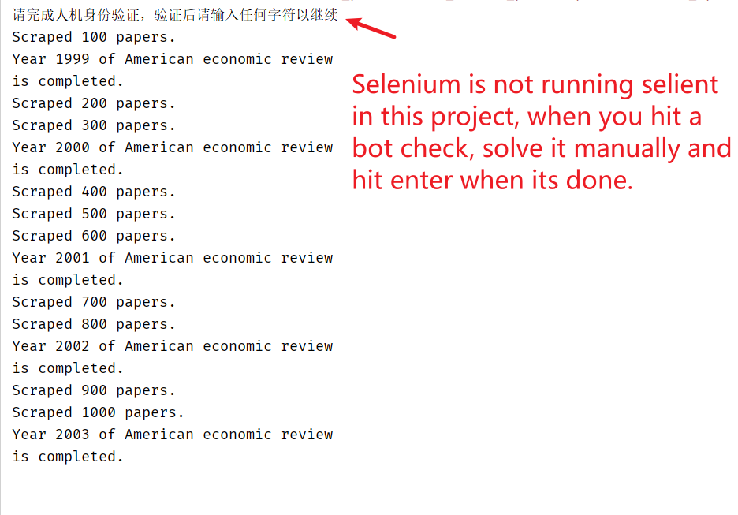

# Scholar crawler 学术爬虫

This projects aims to crawl title and citation from given journals, 
with few human interaction, then download from url or scihub. 

Google Scholar : With good pacing, the script is able to 
crawl 1 page in 10 second, and run for at least 100 page until 
it hit a bot check. This project **don't** solve the bot check
however stop and wait for human assistance. (Note there are some paid 
solution for reCAPTCHA) So it's not for you if you want to crawl
for a data lake.

Scihub : TBD

### Highlight
* Mock user behaviour to alleviate bot ban
  * mock mouse move
  * mock mouse scroll
  * mock click
  * mock input