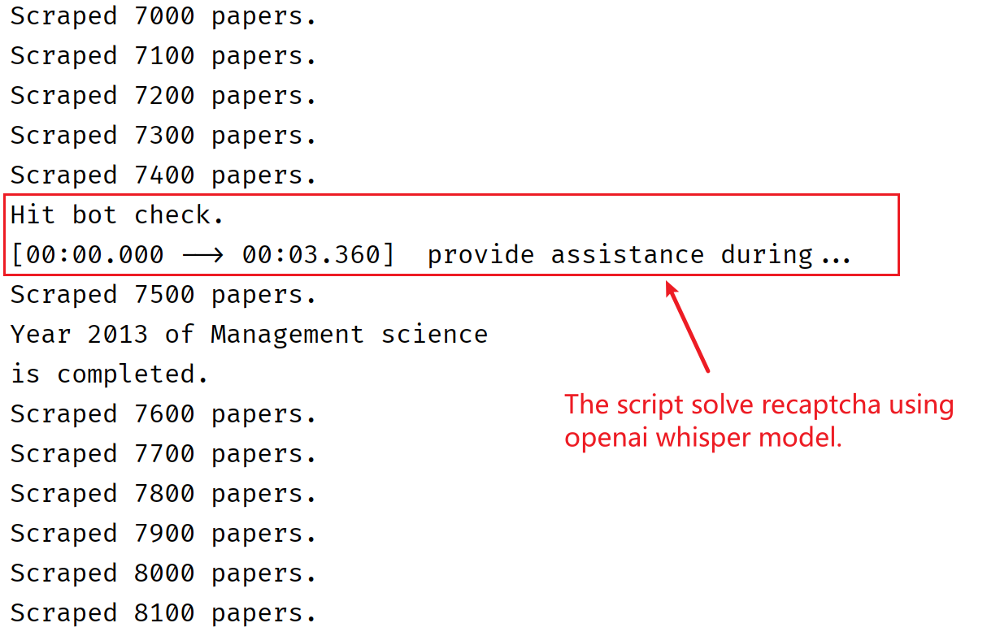

# Scholar crawler 学术爬虫

This projects aims to crawl title and citation from given journals, 
with few human interaction, then download from url or scihub. Achieve
97%+ success rate on a wide range of papers.

**Google Scholar`scraper.py`** : With good pacing, the script is able to 
crawl 1 page in 10 second, and run for at least 100 page until 
it hit a bot check. This project **don't** solve the bot check
however stop and wait for human assistance. (Note there are some paid 
solution for reCAPTCHA) So it's not for you if you want to crawl
for a data lake.

**Scihub`Downloader.py`** :  Try to download the links 
scrapped from google scholar. If failed, it will fallback to 
scihub. If failed again, it will fallback to scihub backbones.
There are lots of sci-hub mirrors, be sure plenty to put accessible
mirrors in `_get_available_scihub_urls()`. It's recommended to 
add at least 5 mirrors for load balancing.

**Clash `clash.py`**: Change proxy server before google gets
irritated. TBD

